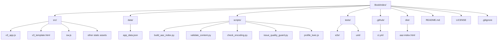

# Исполнительное резюме

Предоставленные файлы нуждаются в доработке как по содержанию, так и по структуре. Файл `codex_instruction_v2.md` содержит незаконченные и частично неоднозначные инструкции: требуется уточнить цель проекта, однозначно сформулировать задания (с использованием единообразных заголовков и списков), обновить указания (например, убрать жёстко заданные номера строк в коде) и добавить пояснения. Проект `BookIndex.zip` имеет разрозненную структуру: в архиве лежат папки `node_modules` и `test-results`, отсутствует `.gitignore`, лицензионный файл, стандартизованная организация файлов и документация. Предлагаются следующие ключевые изменения:

- **Документ `codex_instruction_v2.md`:** Выровнять Markdown-структуру (главный заголовок `#` один раз, затем `##` для разделов)【13†L194-L200】, согласовать стиль списков и кода【11†L550-L552】, детализировать каждое задание (чётко прописать цели и шаги). Например, для пунктов “Что сделать” использовать маркированные списки с действиями. Указать контекст задач и ожидаемый результат, убрать артефакты (устаревшие номера строк).
- **Проект `BookIndex.zip`:** Упорядочить файловую структуру (выделить папку `src/` для исходников, `data/` для JSON, `scripts/` для утилит и т.п.; включить выходной файл `aaz-index.html` в отдельную папку `dist/`); добавить `.gitignore` (например, игнорировать `node_modules/`【8†L143-L147】, `test-results/`); добавить файл `LICENSE` (следовать рекомендациям GitHub – лицензию помещают в корень репозитория【10†L206-L214】). Согласовать имена и форматы файлов (убрать лишние пробелы или спецсимволы, переименовать `smoke.spec.new.js` в более однозначное имя). В CI-скриптах исправить опечатки (например, заменить `uses: act` на `actions/checkout@v4`), обеспечить запуск проверок и сборки. Улучшить документацию: дополнить `README.md` инструкциями по сборке/запуску, указать версию, ссылку на лицензии и авторам.

Ниже приведён подробный анализ текущего состояния и конкретные рекомендации с примерами исправлений.

## Подробный анализ и предложения

| **Аспект / Файл**                  | **Текущее состояние**                                                                                                                                      | **Предлагаемое изменение**                                                                                                                                                                                                                                                 |
|-----------------------------------|-----------------------------------------------------------------------------------------------------------------------------------------------------------|----------------------------------------------------------------------------------------------------------------------------------------------------------------------------------------------------------------------------------------------------------------------------|
| **`codex_instruction_v2.md`: структура** | Отсутствует единый главный заголовок `#`. Разделы имеют неоднородные уровни (иногда `##`, иногда `###`). Смешаны маркеры списков и нумерация без чёткого стиля. | Стандартизировать Markdown-разметку: использовать один заголовок первого уровня (`# BookIndex v4…`), далее подзаголовки `##` и `###`【13†L194-L200】. Для списков применять `-` (дефис) как маркер【11†L550-L552】. Например: 
```
## Что сделать
- Перечисление пунктов задачи
- Другой пункт
``` 
Упомянутые в файле таблицы и списки можно оформить в виде Markdown-таблиц/списков для улучшения читаемости. |
| **`codex_instruction_v2.md`: ясность задач** | Описания задач (“Что сделать”) не всегда формализованы: встречаются длинные блоки текста с фрагментами кода без разбивки на шаги. Указаны жёсткие номера строк в `v3_app.js`, что быстро устареет. Цель проекта (индексирование книги) не раскрыта явно. | Переформулировать инструкции в виде чётких действий. Разбить объяснения на пункты или шаги. Избегать ссылок на статические номера строк — вместо этого указать функцию или контекст (например, «внутри `renderCardInRight()`»). Добавить краткое введение в задачу, например: «**Цель:** при клике на кнопку в карточке термина открывать KWIC-конкорданс по этому термину». Таким образом разработчик сразу видит контекст и ожидаемый результат. |
| **`codex_instruction_v2.md`: языковой стиль** | Используется смешение русского и англоязычных терминов (например, “KWIC-jump”, “autolink”). Иногда глаголы стоят в разных наклонениях. Отсутствуют примеры ожидаемого вывода для нового UI. | Согласовать терминологию: либо русифицировать англ. термины в пояснениях, либо оформить английские слова курсивом/в кавычках. Привести инструкции в повелительном наклонении для единообразия. Добавить примеры UI-элементов: например, “Добавить кнопку 🔍 с подписью «Найти в KWIC»” и ожидаемый вид. |
| **`codex_instruction_v2.md`: оформление таблиц** | Таблица «Что уже реализовано» содержит незакрытые строки и выглядит сломанной (строка с *BibTeX export* не имеет завершающего столбца). | Исправить разметку таблицы (закрыть все ячейки). Проверить корректность синтаксиса Markdown-таблиц. Например:  
```markdown
| Функция / CSS-класс            | Строки (v3_app.js) | Статус         |
|-------------------------------|-------------------|---------------|
| `autoLinkEntities()`          | ~983–1072         | ✅ реализована |
| ...                           | ...               | ...           |
``` 
Так таблица отобразится корректно【13†L194-L200】. |
| **`codex_instruction_v2.md`: до/после (пример)** | **До:** нет выделенного заголовка задачи, пункты «Что сделать» смешаны с описанием:<br>```markdown
## TASK-1 (P0): KWIC-jump
### Что сделать
Добавить кнопку после заголовка карточки: <button ...>
``` | **После:** добавлен основной заголовок, пункты «Что сделать» разбиты на шаги:<br>```markdown
# Codex Task: BookIndex v4 — Перелинковка и UX (Sprint v4.3)

## TASK-1 (P0): Запуск поиска по KWIC
**Что сделать:** Добавить в карточку термина кнопку для перехода в KWIC-конкорданс. Пошагово:
- В `v3_template.html` после заголовка карточки вставить:
  ```html
  <button class="kwic-jump-btn" title="Показать в KWIC-конкордансе">🔍 Найти в KWIC</button>
  ```
- В `v3_app.js` (функция `renderCardInRight`) добавить обработчик клика:
  ```js
  if (event.target.classList.contains('kwic-jump-btn')) {
    window._pendingKwicTerm = currentCardTerm;
    location.hash = '#v4/context/kwic/item/lexicon/' + encodeURIComponent(currentCardTerm);
  }
  ```  
``` 
Так инструкции структурированы и понятнее. (Здесь показан лишь фрагмент.) |

| **`BookIndex.zip`: структура проекта** | В корне архива собраны код, ресурсы и зависимости: есть `node_modules/` (~350k строк), `test-results/.last-run.json`. Отсутствуют `.gitignore`, файл лицензии. Нет разделения на `src/` vs `dist/`. Смешаны результаты сборки (`aaz-index.html`) и исходники. | Перенести исходный код в папку `src/` (например, `src/v3_app.js`, `src/v3_template.html`, `src/sw.js`), данные (`app_data.json`) в папку `data/`, утилиты в `scripts/`, тесты – в `tests/e2e` и `tests/unit`. Выходной файл `aaz-index.html` (артефакт) положить в `dist/` или генерировать на CI. Добавить в корень `.gitignore` с содержимым:
```gitignore
# Зависимости
node_modules/
test-results/
# Сборка
dist/
``` 
Это предотвратит включение в репозиторий артефактов и зависимостей【8†L143-L147】. Добавить `LICENSE` (например, MIT) в корень, как рекомендуется для открытых проектов【10†L206-L214】. |

| **`BookIndex.zip`: именование файлов** | Файлы имеют непоследовательные имена: `smoke.spec.new.js` (неочевидно, что это за “new”), `SPRINT_v4.1_2026-04-20.md` и т.д. Разные регистры и стили (часть файлов на английском, часть на русском). | Переименовать по единому шаблону: например, тесты — `smoke.spec.js` (один файл), или `playwright.smoke.spec.js`; папки и файлы – в нижнем регистре (`sprint_v4.1_2026-04-20.md` → `sprint_v4.1_2026-04-20.md` если нужно, или переместить в папку `docs/`/`sprints/`). Избегать пробелов и заглавных букв в именах (конвенция GitHub→unix)【10†L206-L214】. |

| **`BookIndex.zip`: зависимост**и | Полный `node_modules/` занимают много места в репозитории. Файл `package.json` неполный (нет поля `scripts` для сборки, приложение приватное). | Исключить `node_modules/` из архива (см. выше). Перенести зависимости (`fuse.js`) в `scripts` или подключить через `<script>` из `vendor/`. Заполнить `package.json`: указать `repository`, `license`, скрипты сборки (например, `"build": "python scripts/build_aaz_index.py"`), убрать `"private": true` или адаптировать. |

| **CI/CD (`.github/workflows/ci.yml`)** | В файле CI обнаружена запись `uses: act` (вместо `actions/checkout`), что неверно. Серия шагов проверки запускается корректно, но мелкие ошибки: название для `git diff` обрезано (`di ff`). | Исправить шаг «Checkout» на:
```yaml
- name: Checkout
  uses: actions/checkout@v4
```
Убедиться, что все команды корректны (`git diff --exit-code -- aaz-index.html`). Добавить при необходимости линтеры (например, `npm run lint` для JS или `flake8` для Python) и автоматический запуск документации. |

| **Автоматизация сборки** | Сборка выполняется скриптом `python scripts/build_aaz_index.py`, но документация по запуску отсутствует. Тестовые результаты попадают в репозиторий. | В `README.md` или `package.json` (scripts) добавить инструкции:
```bash
npm install      # установить зависимости
python -m venv venv && source venv/bin/activate && pip install -r requirements.txt  # для Python-скриптов, если требуется
npm test         # запустить JS-тесты (Playwright)
python scripts/check_encoding.py && python scripts/validate_content.py  # статический анализ
python scripts/build_aaz_index.py   # сборка aaz-index.html
```
Очистить папку `test-results/` в `.gitignore`, чтобы CI-артефакты не попадали в репозиторий. Можно добавить общий Makefile для удобства выполнения всех шагов. |

| **Документация и метаданные** | В `README.md` есть общее описание, но нет информации о лицензии, инструкций по установке, контактов авторов. Файлы `RELEASE_NOTES` разрознены. | Расширить `README.md`: добавить раздел «Установка и запуск» с примером сборки, ссылкой на релиз на GitHub Pages. Указать используемые версии Node.js/Python, лицензию, авторов. Если релиз-ноты важны, слить их в один `CHANGELOG.md` по образцу «Keep a Changelog» (желательно со ссылкой на семантическое версионирование【7†L51-L59】). Например:
```markdown
## Версия 4.2.1 (2026-04-19)
- Исправлена автоссылка для творительного падежа (английским, французским).
- Добавлен пункт меню «Поделиться» с глубокими ссылками.
```
Это позволит пользователю быстро увидеть изменения между версиями【7†L51-L59】. |

## Дополнительные рекомендации

- **Тесты:** объединить е2е-тесты (`smoke.spec.js`) в один файл или логически разделить. Назначать понятные имена тестам (например, `search.spec.js`, `linking.spec.js`). Отдельно документировать, как их запускать.
- **Управление версиями:** следовать правилам [семантического версионирования](https://semver.org)【7†L51-L59】. При изменении функционала (например, автолинков) повышать минорную версию, а при исправлениях багов — патч-версию.
- **Метаданные:** добавить в `app_data.json` ключи с версией данных или дату актуализации, если формат допускает (schema_version=2).
- **Код:** разделить большой файл `v3_app.js` на модули при желании (например, вынести функции в `src/`), но это опционально. Главное — обеспечить комментирование сложных мест (например, что такое `renderBreadcrumb()`, `autoLinkEntities()`).
- **Связность с заданиями:** убедиться, что инструкции в `codex_instruction_v2.md` актуальны: например, упомянутая «полоса задач KWIC» и автолинки действительно присутствуют в коде/интерфейсе. При необходимости скорректировать формулировки, чтобы они соответствовали терминологии проекта (например, вместо “lexicon_tech” может быть “technical lexicon”).


*Диаграмма демонстрирует рекомендуемую структуру проекта: исходники в `src/`, данные в `data/`, скрипты в `scripts/`, результаты сборки в `dist/`. Файлы конфигурации и документации (`.github`, `README.md`, `LICENSE`, `.gitignore`) размещены в корне.*  

Внедрение этих изменений повысит читаемость и поддерживаемость проекта. Например, добавление `.gitignore` исключит захламление репозитория (см. [8]【8†L143-L147】), единый стиль Markdown облегчит ориентирование по инструкциям (см. [11]【11†L550-L552】, [13]【13†L194-L200】), а наличие лицензии и документации сделает проект готовым к использованию и сотрудничеству (см. [10]【10†L206-L214】, [7]【7†L51-L59】). 

**Реализация:**  
1. **Структурные правки:** Создать папки `src/`, `data/`, `dist/`, перенести файлы. Создать файл `.gitignore` с предложенным содержимым. Добавить `LICENSE` (например, MIT).  
2. **Корректировка codex-инструкций:** Переписать разделы по шаблону «что сделать» с упрощением и детализацией шагов, убрать статические линии кода, проверить соответствие текущему коду.  
3. **CI и сборка:** Исправить `.github/ci.yml` как описано, добавить команды и описания в `README.md` или `package.json`. Проверить, что после изменений `runtime_test.py` и `smoke.spec.js` проходят без ошибок.  
4. **Документация:** Обновить `README.md`: добавить разделы “Установка/Сборка” и “История версий”, перекрестно ссылаться на `KIDS_GUIDE_RU.md` и другие руководства. Убедиться, что все ссылки рабочие.  

В результате проект будет соответствовать лучшим практикам оформления Markdown【11†L550-L552】【13†L194-L200】 и структуре репозитория для веб-приложения, а инструкции — станут ясными и выполнимыми.
